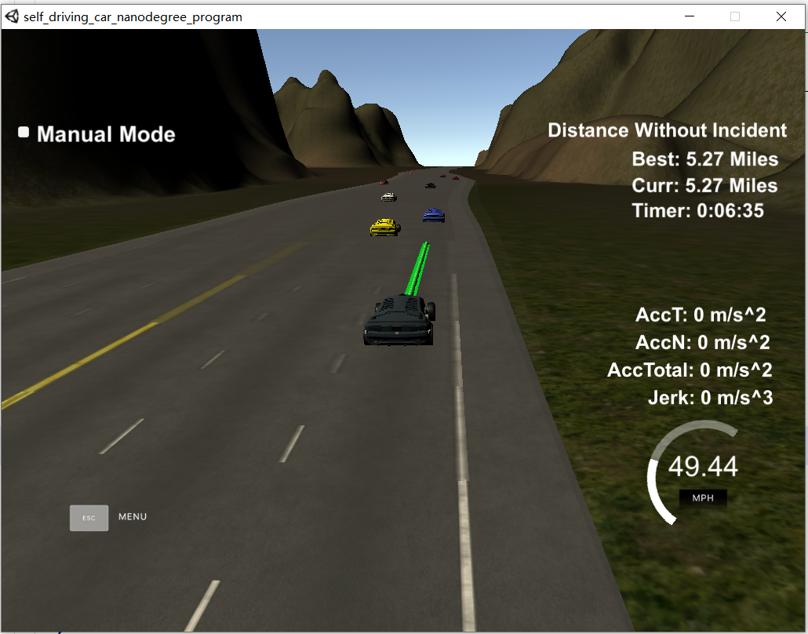

# CarND-Path-Planning-Project
Self-Driving Car Engineer Nanodegree Program


## Reflection
The code resides in the main.cpp file, from line 56 to line 291 inside the `h.onMessage` function. The program consists of three steps to plan a path for the vehicle.

#### Step 1: Observation and Prediction

In this step, the target is to use sensor data to observe and predict the road condition, i.e., if there are cars in the same lane ahead, or in the adjacent lanes. To this end, three bool variables are created and maintained, `car_ahead`, `car_left`, and `car_right`. When they are true, it means vehicles exist in the corresponding positions; the planner should try to avoid hitting them. 

The program first compares the current car d coordinate with the lane width, and figures out which lane the car currently drives on.

```c++
// find which lane I am at
if (car_d <= 4) {
    lane = 0; //left lane
}
else if (car_d > 4 && car_d < 8 ) {
    lane = 1; //middle lane
}
else if (car_d >= 8) {
    lane = 2; //right lane
}

int my_lane = lane;
```

After identifying `my_lane` value, the program uses all the sensor fusion data obtained from the simulator to check if there is car blocking ahead within defined distance, e.g., 30 meters, and if there is car on the adjacent lanes within a set distance (20m is used in this project). It is possible to improve the model by using the speed information of other cars and predict where they are in future. I only used the speed of the car in front of me, but the car speed in adjacent lanes could be also helpful when planning a lane change.

```c++
//car is in my lane within 30 meters
if (d<(2+4*lane+2) && d>(2+4*lane-2) && check_car_s > car_s && (check_car_s-car_s)<30) {
    //if check_car is in my waypoint
    car_ahead = true;
    car_ahead_speed = check_speed;
}

else if (d<(2+4*lane-2) && abs(check_car_s-car_s)<20) {
    car_left = true;
}

else if (d>(2+4*lane+2) && abs(check_car_s-car_s)<20) {
    car_right = true;
}
```

The predication result is output to the terminal for debug.

```c++
cout << "current lane: " << my_lane << "======target lane: " << lane << "======left: " << car_left << "======right: " << car_right  << "======ahead: " << car_ahead << endl;
```


#### Step 2: Behavior Planning

Though it can be a complicate procedure to plan a path using different weighting factors, I used a simple strategy in this project. When the car is blocked by a low speed car in front of it, the car will check the possibility to do a lane change. If both left and right lanes are occupied by other vehicles, my car will gradually reduce its speed to follow the traffic in its lane.

```c++
if (car_ahead) {
    if (!car_left && lane > 0 && car_speed > 20) {
        lane -= 1;
    }
    else if (!car_right && lane < 2 && car_speed > 20) {
        lane += 1;
    }
    else if (car_ahead_speed < car_speed) {
        ref_vel -= 0.224/2; //0.224 = 5m/s
    } 
    else if (car_ahead_speed > car_speed + 0.224) {
        ref_vel += 0.224/2; //5m/s
    }
}
else if (ref_vel < 49.5) {
    ref_vel += 0.224*1.5;            
}
```


#### Step 3: Trajectory Generation

The trajectory generation is based on spline function, and details have been introduced in the course videos. 

This part uses the current car position as the coordinates origin. So the first step is to set the reference point as where the car is or at the previous path end point.

```c++
//set the car coordicate reference point as where the car is or at the previous paths end point
double ref_x = car_x; 
double ref_y = car_y;
double ref_yaw = deg2rad(car_yaw);

if (prev_size < 2) {
    double prev_car_x = car_x - cos(car_yaw);
    double prev_car_y = car_y - sin(car_yaw);

    ptsx.push_back(prev_car_x);
    ptsx.push_back(car_x);
    ptsy.push_back(prev_car_y);
    ptsy.push_back(car_y);

} else {
    //redefine reference state as previous path end point
    ref_x = previous_path_x[prev_size-1];
    ref_y = previous_path_y[prev_size-1];

    double ref_x_prev = previous_path_x[prev_size-2];
    double ref_y_prev = previous_path_y[prev_size-2];
    ref_yaw = atan2(ref_y-ref_y_prev, ref_x-ref_x_prev);

    ptsx.push_back(ref_x_prev);
    ptsx.push_back(ref_x);   
    ptsy.push_back(ref_y_prev);
    ptsy.push_back(ref_y); 

}  
```

Vectors `ptsx` and `ptsy` are the sparse anchor points that will be passed to the curve fitting function to generate the real path and speed. In the above code snippet, the previous two locations of the car are pushed into the vectors. 

After the two anchor points, I calculate three future points with 45 meters interval using the waypoints information from the map and the target lane I want the car to be at in the future. The 45 meter distance is selected based on several trials to ensure no abrupt acceleration or jerk.

``` c++
vector<double> next_wp0 = getXY(car_s+45, 2+4*lane, map_waypoints_s, map_waypoints_x, map_waypoints_y);
vector<double> next_wp1 = getXY(car_s+90, 2+4*lane, map_waypoints_s, map_waypoints_x, map_waypoints_y);
vector<double> next_wp2 = getXY(car_s+135, 2+4*lane, map_waypoints_s, map_waypoints_x, map_waypoints_y);

ptsx.push_back(next_wp0[0]);
ptsx.push_back(next_wp1[0]);
ptsx.push_back(next_wp2[0]);

ptsy.push_back(next_wp0[1]);
ptsy.push_back(next_wp1[1]);
ptsy.push_back(next_wp2[1]); 
```

The last part is just to transform from map coordinates to the vehicle coordinates, do the interpolation using spline function, and then transfer back to the map coordinates. The generated x and y points are appended to the existing path points in the planner and maintain a path data length of 50 points. This helps to keep a smooth path, especially when there is delay between controller and vehicle simulator. In my test, the delay is small, and the model only adds one or two points at each iteration.

 ```c++
// change from map to vechile coordicates
for (int i = 0; i < ptsx.size(); i++) {
    double shift_x = ptsx[i] - ref_x;
    double shift_y = ptsy[i] - ref_y;

    ptsx[i] = shift_x*cos(0.0-ref_yaw) - shift_y*sin(0.0-ref_yaw);
    ptsy[i] = shift_x*sin(0.0-ref_yaw) + shift_y*cos(0.0-ref_yaw);
}

// break up with spline points to travel at desired car velocity          
tk::spline s;
s.set_points(ptsx,ptsy);

double target_x = 30.0;
double target_y = s(target_x);
double target_dist = sqrt(target_x*target_x + target_y*target_y);
double x_add_on = 0.0;

for (int i = 0; i < prev_size; ++i) {
    next_x_vals.push_back(previous_path_x[i]);
    next_y_vals.push_back(previous_path_y[i]);
}

for (int i = 0; i < 50-prev_size; ++i) {    

    // pos_x += (dist_inc)*cos(angle+(i+1)*(pi()/100));
    // pos_y += (dist_inc)*sin(angle+(i+1)*(pi()/100));
    double N = target_dist/(0.02*ref_vel/2.24); //2.24 is from mile/hour to meter/second
    double x_point = x_add_on + target_x/N;
    double y_point = s(x_point);

    x_add_on = x_point; //x interval

    double x_ref = x_point;
    double y_ref = y_point;

    // rotate back to map coordicates from vehicle coordinates
    x_point = ref_x + (x_ref*cos(ref_yaw) - y_ref*sin(ref_yaw));
    y_point = ref_y + (x_ref*sin(ref_yaw) + y_ref*cos(ref_yaw));

    next_x_vals.push_back(x_point);
    next_y_vals.push_back(y_point);            
}
 ```

I validated my model with simulator and the car was able to drive more than one lap without any violation (5.27 miles in the picture below). But I also observed the car did not handle very well when the traffic is very heavy where the car had to stay in its lane with abrupt deceleration and stop. This is something I consider to improve in future.




